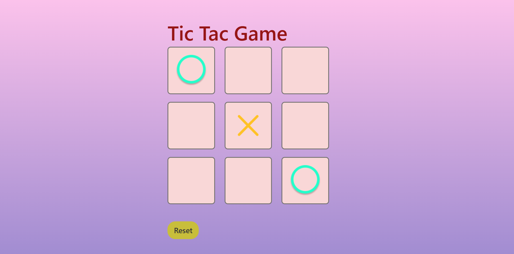

# Tic Tac Toe Game

This is a simple, interactive Tic Tac Toe game built with HTML, CSS, and JavaScript. Players can take turns to play the classic game, and the application will display the winner or a draw. A reset button allows the game to restart.

## Website URL

The website is live and can be accessed at:  
[Play Tic-Tac-Toe](https://lokesh-tic-tac-teo.netlify.app/)

## Features

- **Interactive Gameplay**: Two players (X and O) can take turns.
- **Winner Detection**: Displays the winner when three consecutive marks (X or O) are aligned horizontally, vertically, or diagonally.
- **Reset Option**: Start a new game anytime using the reset button.
- **Responsive Design**: Optimized for a great user experience.

## Screenshot



## How to Play

1. Open the game in a web browser.
2. Player 1 starts with "X", and Player 2 plays with "O".
3. Click on the tiles to place your mark.
4. The game announces the winner when one player aligns three marks in a row, column, or diagonal. It announces a draw if all tiles are filled without a winner.
5. Use the "Reset" button to start a new game.

## Installation

To run this game locally:

1. Clone the repository:
   ```bash
   git clone https://github.com/your-username/tic-tac-toe.git

   
